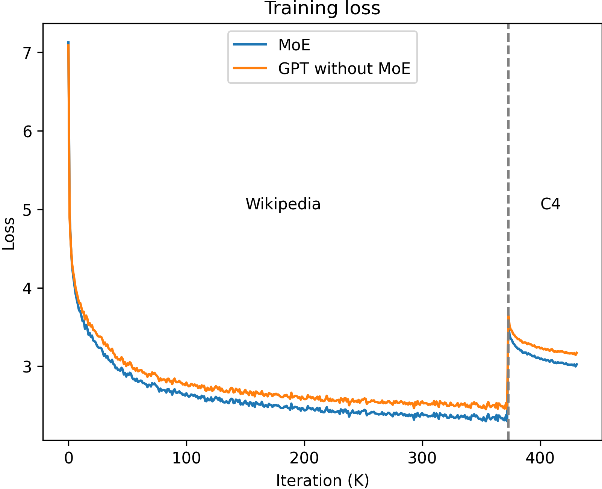

## SpecMoE

The goal of SpecMoE is not to provide strong result than the well-known GPT models, such as llama-7b. **Our goal is to use small models with less layers to approximate the performance of those big GPT models. Therefore, we can achieve low latency in model inference  and get satisfied results.**  This technique is also know as Speculative Inference, in which we use small speculative model in model inference to produce sentences token by token, and then use the big model to verify the result with only one pass through the big model. In this way, Model Inference can be accelerated and the accuracy of the small speculative model influence the hit rate and thus the acceleration.

SpecMoE provides two well-trained models. One is a two-layer GPT model and the other is a two-layer  Sparse MoE GPT model.

This repo also provides the training script of these two models.


### 1. QuickStart and Usage

**Usage of the well-trained model**

```
LlamaForCausalLM.from_pretrained( <huggingface/path> )
```


### 2.  Checkpoint Details and Evaluation

#### Training script

```
# train
# train on wikipedia dataset
bash train_llama.sh      

# add path of the checkpoint pre-trained on the wikipedia dataset in the script
# train on 1% C4 dataset
bash train_llama_c4.sh   


# Evaluation
python3 ssm_evaluate.py --dataset_name alpaca --checkpoint_path <checkpoint_dir>/pytorch_model.bin
```


#### Training Method and Training loss 

We train both two models ("GPT without MoE" and "8 $\times$ 265M MoE") from scratch with FP32 precision. We firstly train the model through  wikipedia dataset with 1 epoch and then through 10% of C4 dataset (10 data shards among 1024 data shards) with 1 epoch.

The training process is as follow.



**Model Parameter**

| Model               | #Experts | #Activated Experts | #Params | # Activated Params | Flops(T) per sample （se q=2048） |
| ------------------- | -------- | ------------------ | ------- | ------------------ | --------------------------------- |
| GPT without MoE     | -        | -                  | 265M    | 265M               | 0.48                              |
| 8 $\times$ 265M MoE | 2        | 8                  | 970M    | 332M               | 0.76                              |
| llama-7b            | -        | -                  | 7B      | 7B                 | 25.29                             |

**Model Evaluation**

We use the "Average number of tokens verified" $N$ ( see reference  [link](https://arxiv.org/abs/2305.09781) ） as the metric to evaluate these models. These metric demonstrates that giving the same input to the small speculative model and llama-7b, counting from the first predicted tokens, how many successive tokens in the output sentence of the small speculative model are the same as the output sentence of the  llama-7b.

- **Average number of tokens verified**

| Dataset                               | 8 $\times$ 265M MoE | GPT without MoE |
| ------------------------------------- | ------------------- | --------------- |
| tatsu-lab/alpaca                      | 3.2362              | 3.0334          |
| alespalla/chatbot_instruction_prompts | 3.2031              | 3.0823          |
| web_questions                         | 2.7201              | 2.5541          |
| MohamedRashad/ChatGPT-prompts         | 3.0954              | 2.9768          |

Supposed that the small speculative model can have a hit rate $p$ for the next token when giving the same input.  Then we have

$$ 1p + 2p^2 + 3p^3 + ... =  N $$

We can get the hit rate as follow.

$$ p = 1 + \frac{1-\sqrt{1+4N}}{2N}$$

- **Hit Rate**

| Dataset                               | 8 $\times$ 265M MoE | GPT without MoE |
| ------------------------------------- | ------------------- | --------------- |
| tatsu-lab/alpaca                      | 0.578               | 0.567           |
| alespalla/chatbot_instruction_prompts | 0.576               | 0.570           |
| web_questions                         | 0.550               | 0.540           |
| MohamedRashad/ChatGPT-prompts         | 0.571               | 0.565           |


### Limitation and Future Plans

For the MoE model, we show the accuracy about how this small speculative model approximate the performance of llama-7b. In practice, to achieve physically low latency, the implementation of our MoE needs to be improve. In this version, we calculate the result of MoE expert by expert (sequentially) , and we need to fuse the calculation of these experts.


### Acknowledgement

1. Our implementation of MoE structure base on the repo `https://huggingface.co/llama-moe/LLaMA-MoE-v1-3_5B-2_8`
2. Our inspiration of Speculative Inference comes from the paper "SpecInfer: Accelerating Generative Large Language Model Serving with Tree-based Speculative Inference and Verification" ([link](https://arxiv.org/abs/2305.09781)) 


### Contact

If you have any interest or question about this project, please feel free to contact me.

`liujc19@mails.tsinghua.edu.cn` （before June 30, 2024） or

`liujc19@tsinghua.org.cn` （After June 30, 2024） 